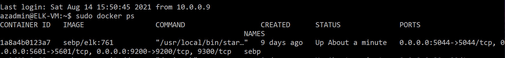

# ELK-Stack-Project

The files in this repository were used to configure the network depicted below.

Diagrams/Network diagram with ELK.png

These files have been tested and used to generate a live ELK deployment on Azure. They can be used to either recreate the entire deployment pictured above. Alternatively, select portions of the _____ file may be used to install only certain pieces of it, such as Filebeat.

  Ansible/filebeat-playbook.yml.txt

This document contains the following details:
- Description of the Topologu
- Access Policies
- ELK Configuration
  - Beats in Use
  - Machines Being Monitored
- How to Use the Ansible Build

### Description of the Topology

The main purpose of this network is to expose a load-balanced and monitored instance of DVWA, the D*mn Vulnerable Web Application.

Load balancing ensures that the application will be highly avilabe, in addition to restricting access to the network.
  Load balancers protects the system from DDoS attacks by shifting attack traffic. 
  The advantage of a jump box is to give access to the user from a single node that can be secured and monitored.

Integrating an ELK server allows users to easily monitor the vulnerable VMs for changes to the jumpbox and system network.
- Filebeat watches for Log Data.
- Metricbeat collects metric data of your system.

The configuration details of each machine may be found below.
_Note: Use the [Markdown Table Generator](http://www.tablesgenerator.com/markdown_tables) to add/remove values from the table_.

| Name     | Function  | IP Address | Operating System |
|----------|-----------|------------|------------------|
| Jump Box | Gateway   | 10.0.0.9   | Linux            |
| Web-1    | Webserver | 10.0.0.10  | linux            |
| Web-2    | Webserver | 10.0.0.11  | Linux            |

### Access Policies

The machines on the internal network are not exposed to the public Internet. 

Only the Jump Box machine can accept connections from the Internet. Access to this machine is only allowed from the following IP addresses:
- 69.120.229.14
   

Machines within the network can only be accessed by Jumpbox VM.
- Jumpbox VM can access ELK vm. The IP address of Jumpbox within the network is 10.0.0.9

A summary of the access policies in place can be found in the table below.

| Name     | Publicly Accessible | Allowed IP Addresses |
|----------|---------------------|----------------------|
| Jump Box | No                  | 69.120.229.14        |
| Web-1    | No                  | 10.0.0.4             |
| Web-2    | No                  | 10.0.0.4             |
| ELK      | No                  | 10.0.0.4             |

### Elk Configuration

Ansible was used to automate configuration of the ELK machine. No configuration was performed manually, which is advantageous because...
- The primary benefit of Ansible is it allows IT administrators to automate away the drudgery from their daily tasks. 
  That frees them to focus on efforts that help deliver more value to the business by spending time on more important tasks

The playbook implements the following tasks:
- Install Dokcer and docker.io
- Install python3-pip
- Set vm.max_map_count to 262144
- Download the image sebp and install it 

The following screenshot displays the result of running `docker ps` after successfully configuring the ELK instance.

### Target Machines & Beats
This ELK server is configured to monitor the following machines:
  Web-1: 10.0.0.10
  Web-2: 10.0.0.11

We have installed the following Beats on these machines:
   Filebeat
   Metricbeat

These Beats allow us to collect the following information from each machine:
- Filebeat is a lightweight shipper for forwarding and centralizing log data. 
  Installed as an agent on your servers, Filebeat monitors the log files or locations that you specify, collects log events, and forwards them either to Elasticsearch or Logstash for indexing.
- Metricbeat is a lightweight shipper that you can install on your servers to periodically collect metrics from the operating system and from services running on the server. 
  Metricbeat takes the metrics and statistics that it collects and ships them to the output that you specify, such as Elasticsearch or Logstash.

### Using the Playbook
In order to use the playbook, you will need to have an Ansible control node already configured. Assuming you have such a control node provisioned: 

SSH into the control node and follow the steps below:
- Copy the ansible.cfg file to /etc/ansible.
- Update the _____ file to include...
- Run the playbook, and navigate to ____ to check that the installation worked as expected.

_TODO: Answer the following questions to fill in the blanks:_
- _Which file is the playbook? Where do you copy it?_
- To make an asnible to run a playbook on a specific machine you are supposed to update the hosts file where you add the name and the IP of a machine. 
- In order to check if the ELK is up and running you navigate to http://[your.ELK-VM.External.IP]:5601/app/kibana.

_As a **Bonus**, provide the specific commands the user will need to run to download the playbook, update the files, etc._
